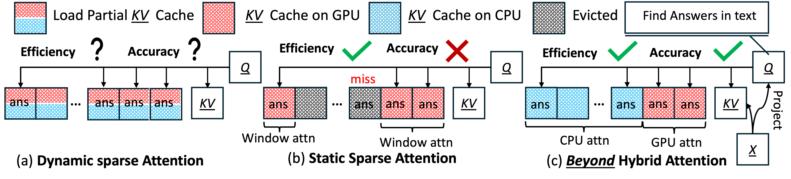

##  Attention Beyond the scope of GPU memory for LLMs inference 




we propose Beyond, a hybrid CPU-GPU attention method that seamlessly integrates into LLMs to enhance inference speed without requiring additional fine-tuning. Beyond supports unlimited-length context inference while maintaining performance stability and efficiency.  Beyond empirically categorizes the KV cache into two groups based on past attention score. The GPU performs dense attention on groups with frequent high scores, while the CPU processes sparse attention for the remaining groups. The resulting attention states are merged on the GPU, minimizing data transfer requirements and enabling a larger attention window.  
 
### Environment Setup

```bash
git clone --recurse-submodules git@github.com:deng451e/Beyond.git
cd Beyond 
conda create -yn beyond python=3.10
conda activate beyond
bash install.sh 
```

### Run Models 
  
```bash
cd run-models
# To run original models 
python run-llama.py 
python run-opt.py 
python run-gptNeox.py 

# To run origianl models  with Beyond 
python run-llama.py --enable_modify
python run-opt.py --enable_modify
python run-gptNeox.py --enable_modify
```


### To Reproduce Results in paper
  
```bash
# To run preliminary tests
cd  evaluation/preliminary-test

# To run accuracy tests
cd  evaluation/accuracy-test

# To run efficency tests
cd  evaluation/efficency-test


```